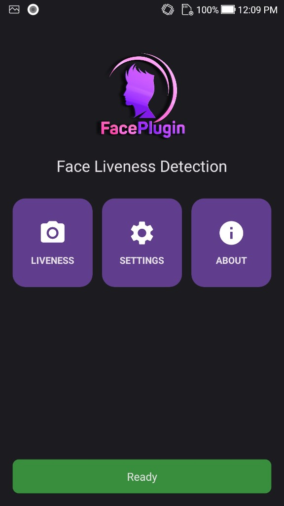
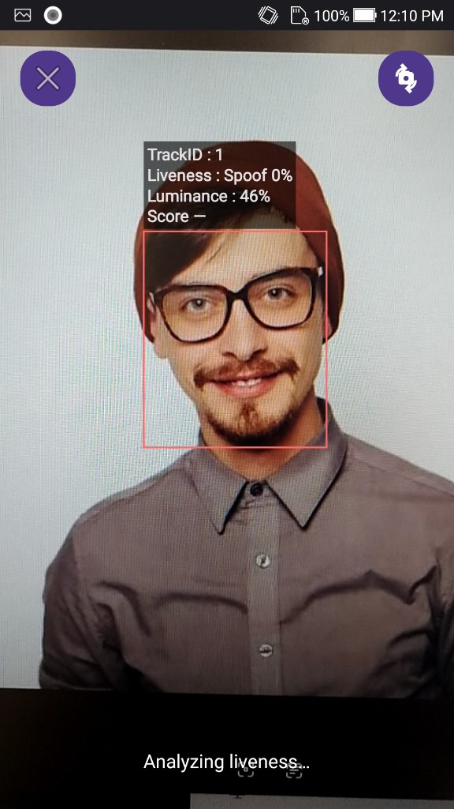
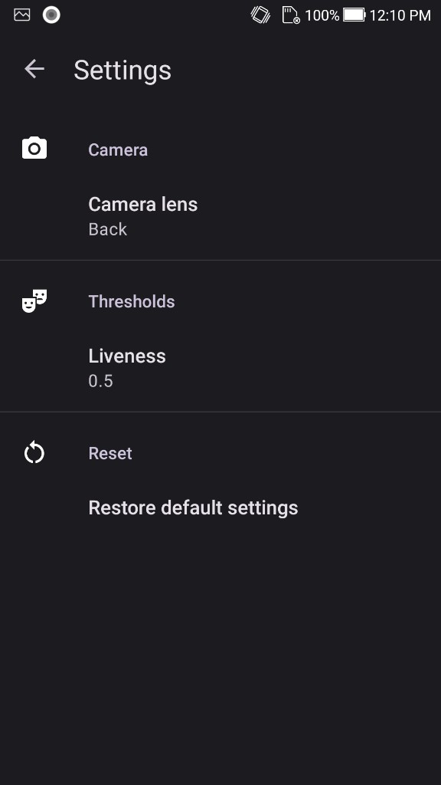
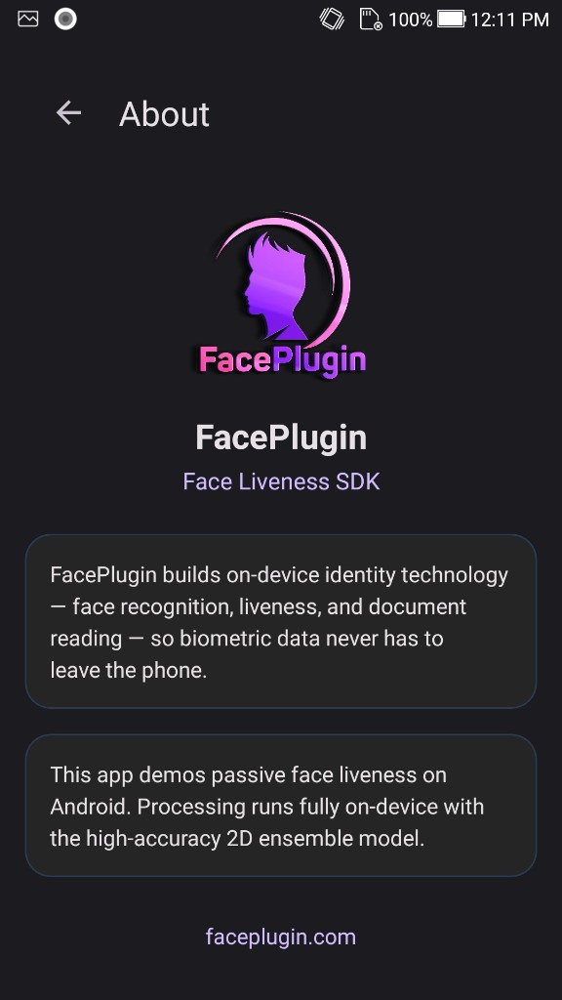
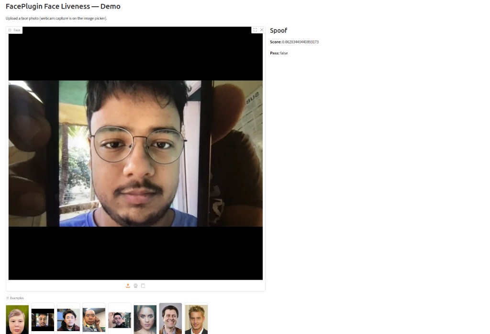

<div align="center">

</div>

#### 🌐 Company Site - [Here](https://faceplugin.com)
#### 🤗 Hugging Face - [Here](https://huggingface.co/FacePlugin-Ltd)
#### 🛟 Help Center - [Here](https://doc.faceplugin.com)
#### 🐳 Docker Hub - [Here](https://hub.docker.com/u/faceplugin)

# FacePlugin Face Liveness Detection SDK — Fully On-Premise

> **iBeta Level 2** class **passive face liveness detection SDK**. Stops printed photos, video replay, 3D masks, and deepfake-style attacks — on your device, with **no** data leaving the device.
> Jump: [Try it](#try-it) · [Screenshots](#screenshots) · [Platforms](#choose-your-platform) · [Products](#list-of-our-products) · [Contact](#contact)

## Overview

FacePlugin **Face Liveness Detection SDK** is a fully **on-premise liveness detection SDK** (presentation-attack detection) for KYC, eKYC, and remote identity verification.

It is **iBeta Level 2 compliant** passive liveness: no smile / turn-head challenge, no extra hardware, no FacePlugin cloud. A live camera frame or a still RGB face is scored for **print, replay, screen, 3D mask, and deepfake** threats.

All processing stays on the phone or in your VPC. **NO** biometric data leaves the device.

Docs: [https://doc.faceplugin.com](https://doc.faceplugin.com)

| You need | This SDK returns |
| -------- | ---------------- |
| Passive PAD | Score + `Real` / `Spoof` + pass / fail |
| Mobile KYC | Live camera HUD (track / liveness / luminance) |
| Server KYC | `POST /api/liveness` on Linux / Docker |
| Privacy | 100% on-device / on-premise |

Need **1:1 / 1:N face match** as well? Use **[Face Recognition SDK](https://github.com/Faceplugin-ltd/Face-Recognition-SDK)**.

## Try it

### Mobile SDK on Google Play

<a href="https://play.google.com/store/apps/details?id=ai.faceplugin.liveness" target="_blank">
  
</a>

### Server SDK on Playground & Hugging Face

- [FacePlugin Playground](https://playground.faceplugin.com/) — try the **server liveness detection SDK** in the browser
- [Hugging Face Space](https://huggingface.co/spaces/FacePlugin-Ltd/FaceRecognition-LivenessDetection-SDK) — face recognition + liveness demo

### Linux / Docker (no Drive)

```bash
docker pull faceplugin/face-liveness:latest
docker run -d --name faceplugin-face-liveness \
  --shm-size=2gb --privileged \
  -p 8084:8084 \
  -v /etc/machine-id:/etc/machine-id:ro \
  faceplugin/face-liveness:latest
curl -s http://127.0.0.1:8084/api/health
```

```bash
curl -s -X POST http://127.0.0.1:8084/api/liveness \
  -H 'Content-Type: application/json' \
  -d '{"image":"<base64-jpeg>"}'
```

Score **≥ 0.5** → `Real` / `pass: true`. Full guide: [FaceLivenessDetection-Docker](https://github.com/Faceplugin-ltd/FaceLivenessDetection-Docker).

## Screenshots

| Home | Liveness | Settings | About |
| ---- | -------- | -------- | ----- |
| <p align="center"></p> | <p align="center"></p> | <p align="center"></p> | <p align="center"></p> |

<p align="center">

</p>

## On YouTube

<div align="center">
<a href="https://www.youtube.com/watch?v=cjvEBzFpHGk" target="_blank">
 
</a>
</div>

## Choose your platform

This GitHub repo is the **product hub**. Clone the platform SDK you need — each one is standalone. Engine binaries are on Google Drive (too large for GitHub); Docker Hub already includes the runtime.

| Platform | Repository | Fastest path |
| -------- | ---------- | ------------ |
| **Android (Java, Kotlin)** | [FaceLivenessDetection-Android](https://github.com/Faceplugin-ltd/FaceLivenessDetection-Android) | Drop `facelivenessdk.aar` → Liveness tile |
| **iOS (Objective-C, Swift)** | [FaceLivenessDetection-iOS](https://github.com/Faceplugin-ltd/FaceLivenessDetection-iOS) | Add frameworks → run the sample |
| **Windows** | [FaceLivenessDetection-Windows](https://github.com/Faceplugin-ltd/FaceLivenessDetection-Windows) | Native Windows liveness demo |
| **Linux / Docker** | [FaceLivenessDetection-Docker](https://github.com/Faceplugin-ltd/FaceLivenessDetection-Docker) | `docker pull faceplugin/face-liveness` |

Building **enroll + identify + liveness** together? Start from Face Recognition (liveness is on the identify / capture path):

| Combined KYC | Repository |
| ------------ | ---------- |
| Android | [FaceRecognition-Android](https://github.com/Faceplugin-ltd/FaceRecognition-Android) |
| iOS | [FaceRecognition-iOS](https://github.com/Faceplugin-ltd/FaceRecognition-iOS) |
| React Native | [FaceRecognition-React-Native](https://github.com/Faceplugin-ltd/FaceRecognition-React-Native) |
| Flutter | [FaceRecognition-Flutter](https://github.com/Faceplugin-ltd/FaceRecognition-Flutter) |
| Ionic Capacitor | [FaceRecognition-Ionic-Capacitor](https://github.com/Faceplugin-ltd/FaceRecognition-Ionic-Capacitor) |
| Ionic Cordova | [FaceRecognition-Ionic-Cordova](https://github.com/Faceplugin-ltd/FaceRecognition-Ionic-Cordova) |
| Windows | [FaceRecognition-Windows](https://github.com/Faceplugin-ltd/FaceRecognition-Windows) |
| Linux / Docker | [FaceRecognition-Docker](https://github.com/Faceplugin-ltd/FaceRecognition-Docker) |

## List of our Products

**Face Recognition with Liveness Detection**

- [Android (Java, Kotlin)](https://github.com/Faceplugin-ltd/FaceRecognition-Android)
- [iOS (Objective-C, Swift)](https://github.com/Faceplugin-ltd/FaceRecognition-iOS)
- [React Native](https://github.com/Faceplugin-ltd/FaceRecognition-React-Native)
- [Flutter](https://github.com/Faceplugin-ltd/FaceRecognition-Flutter)
- [Ionic Capacitor](https://github.com/Faceplugin-ltd/FaceRecognition-Ionic-Capacitor)
- [Ionic Cordova](https://github.com/Faceplugin-ltd/FaceRecognition-Ionic-Cordova)
- [.NET MAUI](https://github.com/Faceplugin-ltd/FaceRecognition-.Net)
- [.NET WPF](https://github.com/Faceplugin-ltd/FaceRecognition-WPF-.Net)
- [JavaScript](https://github.com/Faceplugin-ltd/FaceRecognition-LivenessDetection-Javascript)
- [React](https://github.com/Faceplugin-ltd/FaceRecognition-LivenessDetection-React)
- [Vue](https://github.com/Faceplugin-ltd/FaceRecognition-LivenessDetection-Vue)
- [Windows](https://github.com/Faceplugin-ltd/FaceRecognition-Windows)
- [Linux / Docker](https://github.com/Faceplugin-ltd/FaceRecognition-Docker)

**Face Liveness Detection SDK**

- [Android (Java, Kotlin)](https://github.com/Faceplugin-ltd/FaceLivenessDetection-Android)
- [iOS (Objective-C, Swift)](https://github.com/Faceplugin-ltd/FaceLivenessDetection-iOS)
- [Windows](https://github.com/Faceplugin-ltd/FaceLivenessDetection-Windows)
- [Linux / Docker](https://github.com/Faceplugin-ltd/FaceLivenessDetection-Docker)

**More FacePlugin**

- [Face Recognition SDK (hub)](https://github.com/Faceplugin-ltd/Face-Recognition-SDK)
- [Face Liveness Detection SDK (this hub)](https://github.com/Faceplugin-ltd/Face-Liveness-Detection-SDK)
- [Open Source Face Recognition SDK](https://github.com/Faceplugin-ltd/Open-Source-Face-Recognition-SDK)
- [Palm Recognition SDK](https://github.com/Faceplugin-ltd/Palm-Recognition)
- [ID Document Recognition SDK](https://github.com/Faceplugin-ltd/ID-Document-Recognition-SDK)
- [ID Document Liveness Detection](https://github.com/Faceplugin-ltd/ID-Document-Liveness-Detection-Docker)

## Contact

<div align="left">
<a target="_blank" href="mailto:info@faceplugin.com"></a>&emsp;
<a target="_blank" href="https://wa.me/+14692784822"></a>
</div>
